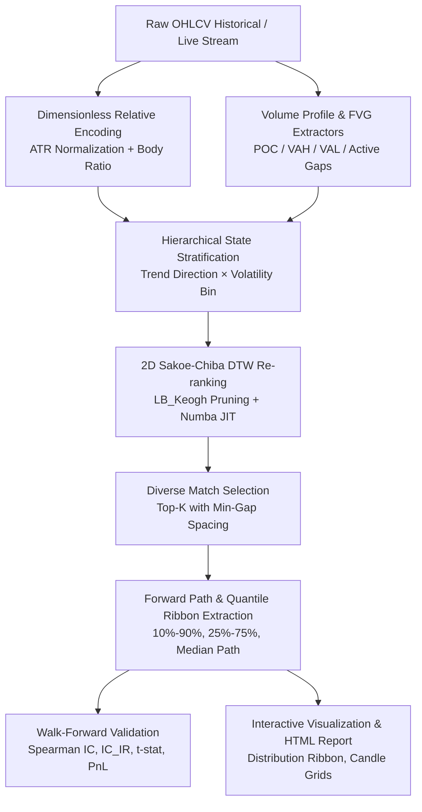

<div align="center">

# 🕯️ CandleWarp

**High-Performance DTW Candlestick Pattern Similarity & Probabilistic Trend Distribution Engine**

[English](README_EN.md) | [简体中文](README.md)

[](https://www.python.org/)
[](LICENSE)
[](https://numba.pydata.org/)
[](#walk-forward-validation)

*Answer the definitive quantitative question without directional bias:*  
**"When similar candlestick patterns appeared in history, what did the subsequent $N$-bar path distribution look like?"**

</div>

---

## 🌟 Highlights

- **⚡ Sub-Millisecond 2D Sakoe-Chiba DTW**: JIT-compiled with Numba delivering **>300x acceleration** (`~0.009ms` per match) with $O(N)$ `LB_Keogh` lower-bounding pruning and automatic NumPy fallback.
- **📏 Dimensionless Relative Space**: OHLC windows are projected into ATR-normalized price coordinates and body-ratio geometry, eliminating cross-era price level and volatility scale distortions.
- **🔍 Volume Profile & FVG Modalities**: Incorporates Point of Control (POC), Value Area (VAH/VAL), Volume Skewness, and Fair Value Gaps (3-bar unmitigated liquidity voids).
- **🛡️ Dual Confidence Gating**: Rejects low-confidence noise with minimum sample thresholds ($K_{min}$) and distance outlier cutoffs.
- **🎯 Softmax Distance-Weighted Quantiles**: Replaces uniform sampling with distance-weighted probabilistic ribbons ($Q_{10}, Q_{25}, Q_{50}, Q_{75}, Q_{90}$).
- **🔬 Zero-Lookahead Walk-Forward Engine**: Strictly causal rolling evaluation reporting Spearman IC, Information Ratio ($\text{IC\_IR}$), $t$-statistics, and asymmetric risk-reward expectancy.

---

## 🏛️ Architecture



---

## 🚀 Quick Start

### 1. Installation

```bash
git clone https://github.com/simom1/CandleWarp.git
cd CandleWarp
pip install -r requirements.txt
```

### 2. Generate Deterministic Sample Data

```bash
python3 -m a_shape_tool.cli --make-sample data/sample_ohlcv.csv --rows 2000
```

### 3. Single-Window Pattern Distribution Query

Scan historical windows similar to the current market state and project future distributions:

```bash
python3 -m a_shape_tool.cli \
  --csv data/sample_ohlcv.csv \
  --timeframe 1h \
  --window 100 \
  --horizon 50 \
  --top-k 30 \
  --use-vp \
  --use-fvg \
  --output-dir output
```

**Generated Outputs:**
- `output/distribution.png`: Forward return quantile ribbon and sample paths.
- `output/top_matches_ohlc.png`: Candlestick grid of historical query vs. top matched periods.
- `output/similarity_diagnostics.png`: Multi-dimensional feature diagnostics.
- `output/report.html`: Comprehensive interactive report.
- `output/matches.csv` & `output/quantiles.csv`: Detailed numerical datasets.

---

## 🔬 Walk-Forward Validation

Evaluate out-of-sample statistical power across historical regimes without lookahead leakage:

```bash
python3 -m a_shape_tool.cli \
  --csv data/sample_ohlcv.csv \
  --timeframe 1h \
  --window 100 \
  --horizon 50 \
  --top-k 20 \
  --min-valid-samples 5 \
  --min-match-gap 20 \
  --backtest \
  --min-history 600 \
  --stride 25 \
  --cost-bps 2 \
  --output-dir output_backtest
```

### Output Evaluation Metrics
- **Median MAE Improvement**: Similarity prediction error vs. state-baseline error.
- **Spearman IC & Information Ratio ($\text{IC\_IR}$)**:
  $$\text{IC\_IR} = \frac{\text{Mean}(\text{IC})}{\text{Std}(\text{IC})}, \quad t\text{-stat} = \text{IC\_IR} \times \sqrt{N}$$
- **Asymmetric Expectancy Ratio**:
  $$\text{Asymmetry} = \frac{Q_{75} - Q_{50}}{Q_{50} - Q_{25}}$$

---

## 📐 Mathematical Formulation

### 1. Dimensionless Feature Representation
For any OHLC window of length $W$ ending at bar $T$:

$$\text{rel\_open}_t = \frac{\text{open}_t - \text{close}_0}{\text{ATR}_T}, \quad \text{rel\_close}_t = \frac{\text{close}_t - \text{close}_0}{\text{ATR}_T}$$

$$\text{body\_ratio}_t = \frac{\text{close}_t - \text{open}_t}{\text{high}_t - \text{low}_t} \times w_{\text{body}}$$

### 2. 2D Sakoe-Chiba DTW Distance
Restricts warping path $p = (i, j)$ inside band $|i - j| \le w$:

$$D(i, j) = \| \mathbf{x}_i - \mathbf{y}_j \|_2 + \min \begin{cases} D(i-1, j) \\ D(i, j-1) \\ D(i-1, j-1) \end{cases}$$

### 3. Softmax Distance-Weighted Quantiles
Weights assigned to candidate path $k$ based on its DTW distance $d_k$:

$$w_k = \frac{e^{-d_k / \tau}}{\sum_{m=1}^K e^{-d_m / \tau}}, \quad \tau = \text{median}(d)$$

---

## 📁 Repository Structure

```
CandleWarp/
├── a_shape_tool/
│   ├── cli.py             # Unified CLI interface
│   ├── core.py            # Feature encoding, state stratification & matching engine
│   ├── dtw.py             # Numba JIT accelerated 2D Sakoe-Chiba DTW & LB_Keogh
│   ├── vp_fvg.py          # Volume Profile & Fair Value Gap microstructure modules
│   ├── evaluation.py      # Zero-lookahead Walk-Forward engine & IC_IR verification
│   ├── patterns.py        # Fixed-structure scanner (W-bottom, M-top, H&S, Triangles)
│   ├── pivot.py           # ZigZag pivot detector
│   ├── plotting.py        # Distribution ribbons & candlestick grid rendering
│   ├── risk.py            # Risk management & trade execution logic
│   └── sample_data.py     # Realistic synthetic OHLCV generator
├── requirements.txt       # Core dependencies
├── LICENSE                # MIT License
├── README.md              # Chinese Documentation (Default)
└── README_EN.md           # English Documentation
```

---

## 📄 License

This project is licensed under the [MIT License](LICENSE).
