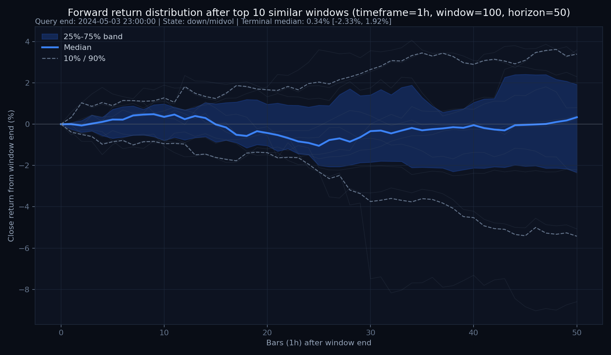
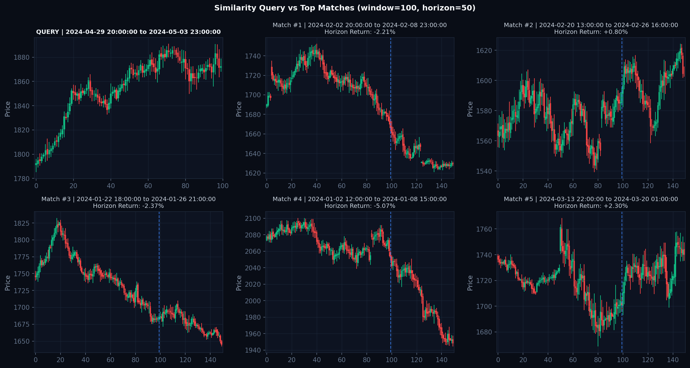

# 📊 CandleWarp 测试结果与图表展示 (Test Results & Visual Showcase)

本目录展示了使用 **`CandleWarp`** 对内置标准测试数据集（黄金 XAUUSD 与比特币 BTCUSD）进行形态相似度匹配与走势分布预测的实际输出。

---

## 🪙 1. 黄金测试结果 (XAUUSD 1H Test Results)

### A. 相似形态走势分布分位带 (Distribution Ribbon & Paths)
展示了基于 2D-DTW 匹配出的 Top-30 历史相似片段在未来 50 根 K 线的实际扩散路径，以及 10%-90%、25%-75% 与中位数概率带：

### B. 相似 K 线对比网格 (Top Matched Candlestick Grids)
当前查询形态与历史最逼真的 Top 相似片段的高清裸 K 对比：

### C. 多维特征匹配诊断 (Multi-Feature Diagnostics)
展示无量纲编码空间、ATR 归一化通道、Volume Profile 筹码峰与 FVG 引力区对齐情况：

---

## 🪙 2. 比特币测试结果 (BTCUSD 1H Test Results)

### A. 比特币走势分布分位带 (BTC Distribution Ribbon)

### B. 比特币相似 K 线对比网格 (BTC Candlestick Grid)

---

## 🔬 3. 滚动验证回测数据明细 (Walk-Forward Backtest Summaries)

| 测试品种 | 滚动评估次数 | 相似预测 MAE | 基准状态 MAE | MAE 改善度 | 25%-75% 覆盖率 | 10%-90% 覆盖率 |
| :--- | :---: | :---: | :---: | :---: | :---: | :---: |
| **黄金 (XAUUSD 1H)** | 54 轮 | **3.118%** | 3.538% | **+11.87%** | 51.9% | 63.0% |
| **比特币 (BTCUSD 1H)** | 53 轮 | 6.513% | 6.414% | -1.55% | 41.5% | 66.0% |

> 详细的回测逐笔明细可查阅：
> - 黄金回测报告：[`xauusd/backtest/backtest_summary.json`](xauusd/backtest/backtest_summary.json)
> - 比特币回测报告：[`btc/backtest/backtest_summary.json`](btc/backtest/backtest_summary.json)
